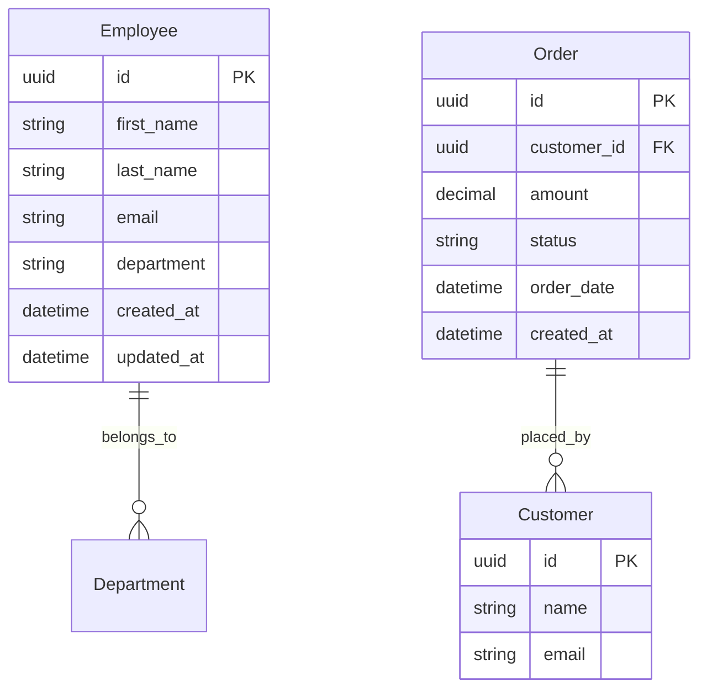

# Employee Directory and Order Management API

## Overview
This project implements a RESTful API for managing an employee directory and processing customer order data. It's built using FastAPI and SQLAlchemy, following clean architecture principles and best practices.

## Requirements
- Python 3.8+
- mySQL+
- Poetry (optional)
- Docker (optional)

## Entity-Relationship Diagram


## Setup Instructions

### Local Development
1. Clone the repository
```bash
git clone https://github.com/yourusername/employee-orders-api.git
cd employee-orders-api
```

2. Create and activate virtual environment
```bash
# Using venv
python -m venv .venv
source .venv/bin/activate  # On Windows: .\venv\Scripts\activate

# OR using Poetry
poetry install
poetry shell
```

3. Install dependencies
```bash
pip install -r requirements.txt
# OR using Poetry: poetry install
```

4. Set up environment variables
```bash
cp .env.example .env
# Edit .env with your database credentials
```

5. Run migrations
```bash
alembic upgrade head
```

6. Run the application
```bash
uvicorn src.main:app --reload
```

7. Run tests
```bash
pytest tests/
```

### Docker Setup (Optional)
```bash
# Build the image
docker build -t employee-orders-api .

# Run the container
docker run -p 8000:8000 employee-orders-api
```

## API Documentation

### Employee Directory
| Method | Endpoint | Description | Request Body | Response |
|--------|----------|-------------|--------------|-----------|
| GET | /api/v1/employees | List all employees | - | Array of employees |
| GET | /api/v1/employees/{id} | Get employee details | - | Employee object |
| POST | /api/v1/employees | Create new employee | Employee data | Created employee |
| PUT | /api/v1/employees/{id} | Update employee | Updated fields | Updated employee |
| DELETE | /api/v1/employees/{id} | Delete employee | - | 204 No Content |

### Order Management
| Method | Endpoint | Description | Request Body | Response |
|--------|----------|-------------|--------------|-----------|
| GET | /api/v1/orders/revenue | Get revenue in date range | start_date, end_date | Revenue data |
| GET | /api/v1/orders | List all orders | - | Array of orders |
| GET | /api/v1/orders/{id} | Get order details | - | Order object |

### Interactive API Documentation
Once the application is running, you can access:
- Swagger UI: http://localhost:8000/docs
- ReDoc: http://localhost:8000/redoc

## Project Structure
```
src/
├── api/           # API routes and controllers
│   ├── routes/
│   └── dependencies/
├── core/          # Domain models and schemas
│   ├── models/
│   └── schemas/
├── services/      # Business logic
├── database/      # Database configurations
└── main.py        # Application entry point

tests/             # Unit and integration tests
├── api/
├── services/
└── conftest.py
```

## Design Decisions
- **Clean Architecture**: Separation of concerns between layers
- **Repository Pattern**: Abstraction of data persistence
- **Service Layer**: Business logic encapsulation
- **Dependency Injection**: Better testability and maintainability
- **Pydantic Models**: Request/Response validation
- **mySQL**: ACID compliance and robust feature set

## Contributing
1. Fork the repository
2. Create a feature branch
3. Commit your changes
4. Push to the branch
5. Create a Pull Request

## License
This project is licensed under the MIT License - see the LICENSE file for details.