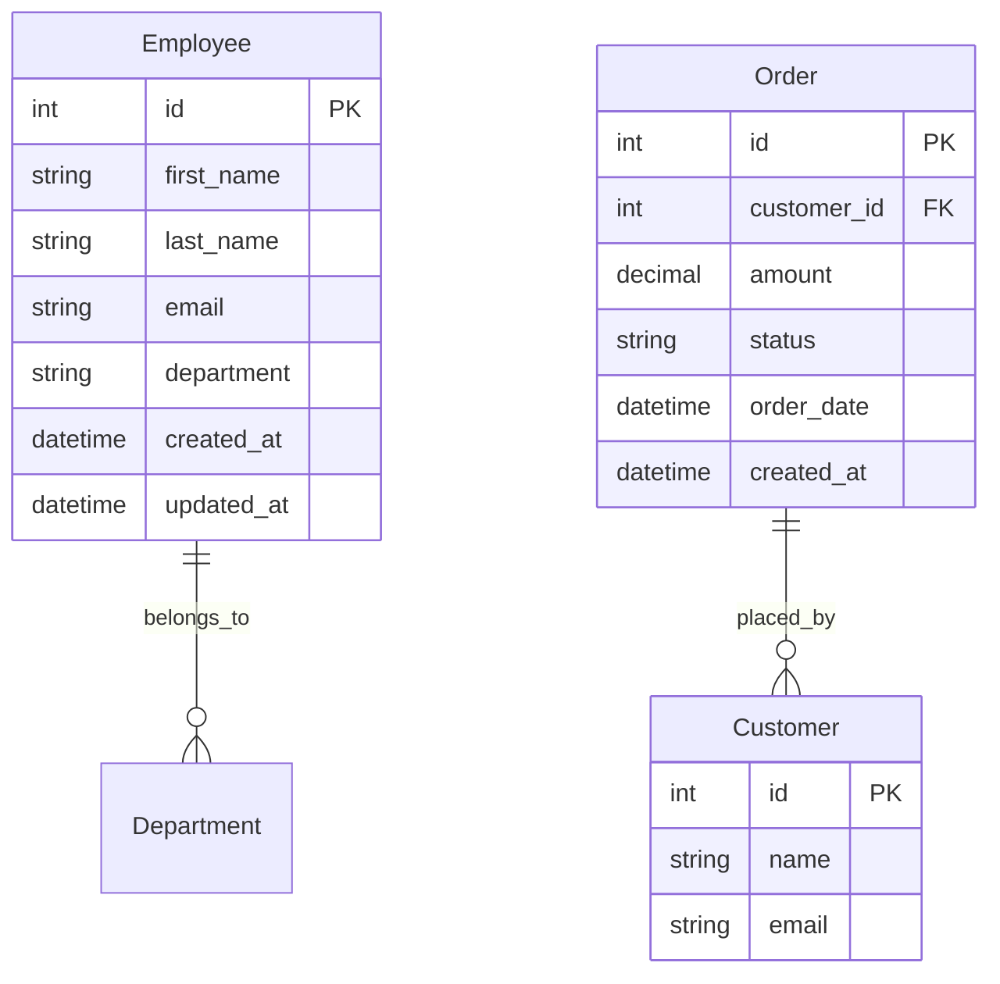

# Employee Directory and Order Management API

## Overview
This project implements a RESTful API for managing an employee directory and processing customer order data. It's built using FastAPI and SQLAlchemy, following clean architecture principles and best practices.

## Entity-Relationship Diagram


## Setup Instructions
1. Clone the repository
```bash
git clone https://github.com/yourusername/employee-orders-api.git
cd employee-orders-api
```

2. Create and activate virtual environment [You can you venv or poetry]
```bash
python -m venv .venv
source .venv/bin/activate  # On Windows: .\venv\Scripts\activate
```

3. Install dependencies
```bash
pip install -r requirements.txt
```

4. Set up environment variables
```bash
cp .env.example .env
# Edit .env with your database credentials
```

5. Run migrations
```bash
alembic upgrade head
```

6. Run the application
```bash
uvicorn src.main:app --reload
```

7. Run tests
```bash
pytest tests/

## API Endpoints

### Employee Directory
- GET /api/v1/employees - List all employees
- GET /api/v1/employees/{id} - Get employee details
- POST /api/v1/employees - Create new employee
- PUT /api/v1/employees/{id} - Update employee
- DELETE /api/v1/employees/{id} - Delete employee

### Order Management
- GET /api/v1/orders/revenue - Get revenue in date range
- GET /api/v1/orders - List all orders
- GET /api/v1/orders/{id} - Get order details

## Project Structure
- src/: Main application code
  - api/: API routes and controllers
  - core/: Domain models and schemas
  - services/: Business logic
  - database/: Database configurations
- tests/: Unit and integration tests

## Design Decisions
- Clean Architecture pattern
- Repository pattern for data access
- Service layer for business logic
- Dependency injection for better testability
- Pydantic for data validation
- PostgreSQL for data persistence
